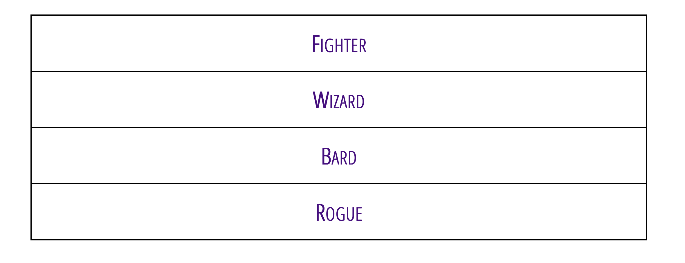
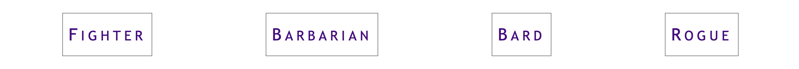
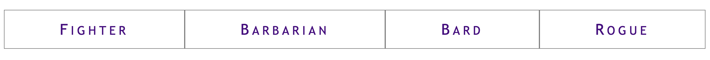

import { Steps, Card, Aside, Code, LinkCard } from '@astrojs/starlight/components';
import { YouTube } from '@astro-community/astro-embed-youtube';

Almost every web project you will build will have a global navigation bar and it will be a Flexbox layout 95% of the time. In this exercise, you will use some nice shortcuts that Flexbox give you our of the box.

## Resources
<Card title="Flexbox vs CSS Grid"><YouTube id="hs3piaN4b5I" /></Card>
<LinkCard title="The Complete Guide to Flexbox" href="https://css-tricks.com/snippets/css/a-guide-to-flexbox/" />
<LinkCard title="Flexbox Froggy" href="https://flexboxfroggy.com/" />
<LinkCard title="Flexbox Froggy" href="https://mastery.games/flexboxzombies/" />

## Starter Code
```html
<!-- index.html -->
<nav>
  <ul>
    <li><a href="#">Home</a></li>
    <li><a href="#">Projects</a></li>
    <li><a href="#">Contact</a></li>
    <li><a href="#">Blog</a></li>
  </ul>
</nav>
```

## Instructions
<Steps>
1. Remove a list's bullets and left padding:
    ```css
    /* style.css */
    nav ul {
      list-style: none;
      padding-left: 0;
    }
    ```
2. Make your links clickable by adding padding to the link (not the list item). You will need to make you links block-level elements for this to work:
    ```css
    // style.css
    nav a {
      display: block;
      padding: 0.5rem 1rem;
    }
    ``` 
    <Aside type="caution" title="Adding padding to the right container">
      In the above example code, we've added padding to the anchor tag. Try adding the padding to the list items (`<li>`) instead. What do you notice about the clickable area of the link?
    </Aside>
3. Add `:hover` states to add interaction for the user:
    ```css "#555"
    // style.css
    nav a:hover {
      background-color: black;
      color: white;
    }
    ```
    <Aside type="note" title="Making things clickable">
      `:hover` states tell the user that an item is clickable. This is very important for navigation and CTAs (Call-to-Action) to make your UI intuitive and increase engagement.
    </Aside>
4. Style your navigation as needed using properties such as:
    - [`color`](https://developer.mozilla.org/en-US/docs/Web/CSS/color)
    - [`background-color`](https://developer.mozilla.org/en-US/docs/Web/CSS/background-color)
    - [`border`](https://developer.mozilla.org/en-US/docs/Web/CSS/border)
    - [`text-decoration`](https://developer.mozilla.org/en-US/docs/Web/CSS/text-decoration)
    - [`font-family`](https://developer.mozilla.org/en-US/docs/Web/CSS/font-family)
    - [`font-variant`](https://developer.mozilla.org/en-US/docs/Web/CSS/font-variant)
    - [`box-shadow`](https://developer.mozilla.org/en-US/docs/Web/CSS/box-shadow)

5. What you should now have is a vertical navigation bar. 

    
6. Lets make it horizontal with Flexbox by create a Flex Container on the `<ul>`:
    ```css
    // style.css
    nav ul {
      display: flex;
    }
    ```

    
6. Now we can use `justify-content` to arrange the buttons in a number of pre-set layouts. First lets send the links to the far right of the page with `flex-end`:
    ```css {4}
    // style.css
    nav ul {
      display: flex;
      justify-content: flex-end;
    }
    ```

    
7. You can centre the links in the menu with `justify-content: center`:
    ```css "center"
    // style.css
    nav ul {
      display: flex;
      justify-content: center;
    }
    ```

    

8. You can put all empty space between the links with `justify-content: space-between`:
    ```css "space-between"
    // style.css
    nav ul {
      display: flex;
      justify-content: space-between;
    }
    ```

    
9. You can put an equal amount of space between each link `space-around`:
    ```css "space-around"
    // style.css
    nav ul {
      display: flex;
      justify-content: space-around;
    }
    ```
  
    

    <Aside type="note" title="Spacing on the ends">
      Note that there is twice as much space _between_ each link than there is on the ends. If you want equal spacing, try `space-evenly` in the next step.
    </Aside>
10. You can space the link equally, including ends, with `space-evenly`:
    ```css "space-evenly"
    // style.css
    nav ul {
      display: flex;
      justify-content: space-evenly;
    }
    ```

    

11. You can have the links expand to fill all empty space with `flex: auto` _on the items_:
    ```css {7-10}
    // style.css
    /* container */
    nav ul {
      display: flex;
    }

    /* items */
    nav ul > * {
      flex: auto;
    }
    ```

    

    <Aside type="caution" title="Applied to the items">
      Note that the styles for this layout are applied to the _items_ (`<li>`) instead of the _container_ (`<ul>`).
    </Aside>
</Steps>

## Finished Example Code
<LinkCard title="Codepen with all of these examples" href="https://codepen.io/acidtone/pen/bGMaLNo" />
